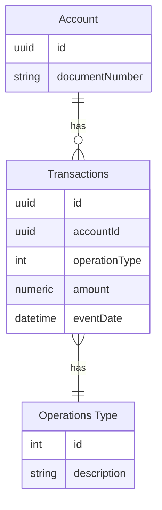
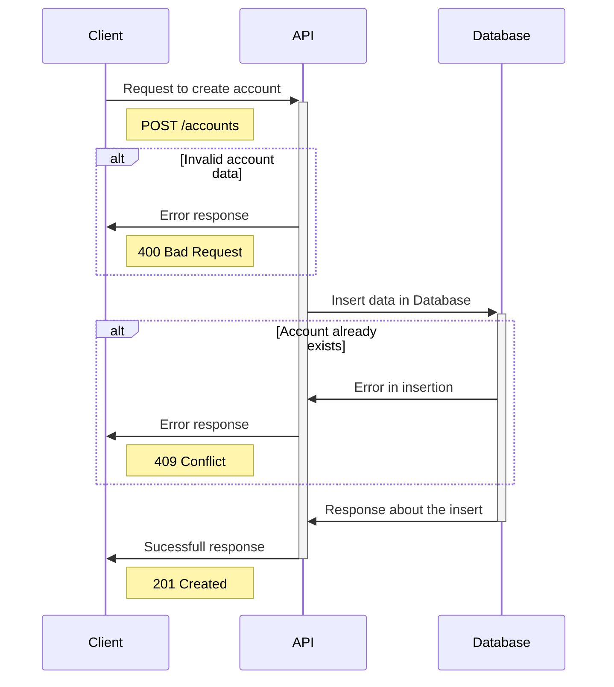
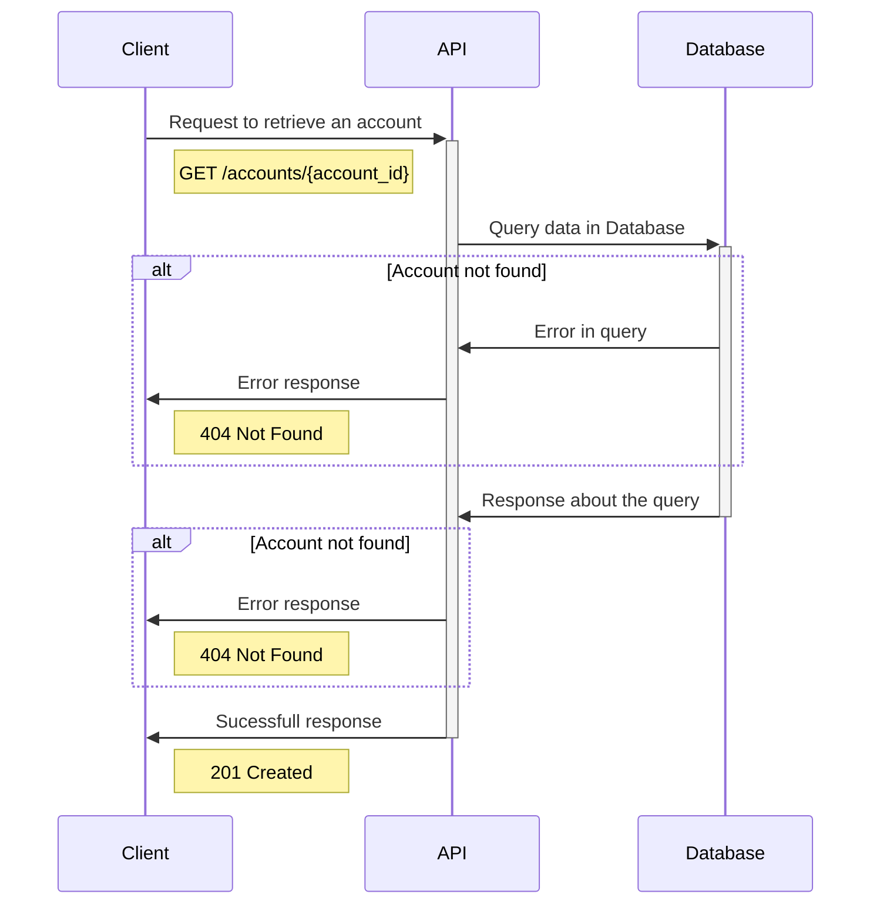
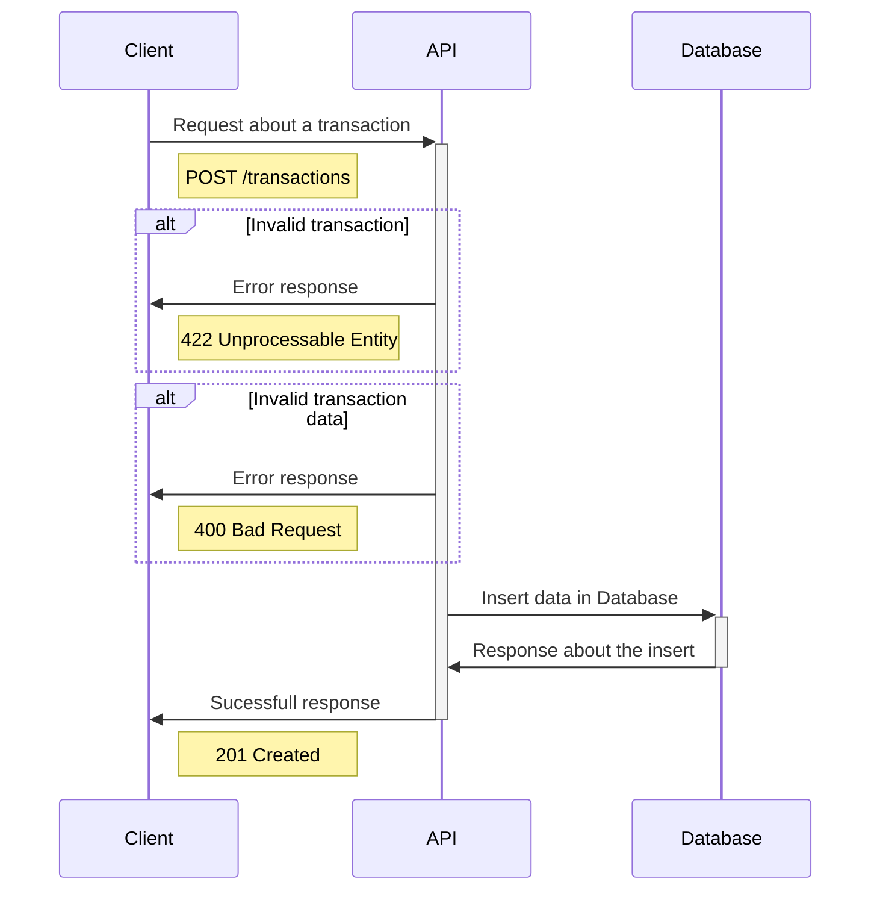

# Bank Account

- [Bank Account](#bank-account)
  - [Sumary](#sumary)
  - [Getting Started](#getting-started)
    - [Technologies](#technologies)
    - [Runing Locally](#runing-locally)
    - [Unit Tests](#unit-tests)
  - [Model](#model)
    - [Rules](#rules)
  - [Endpoints](#endpoints)
    - [POST /accounts](#post-accounts)
    - [GET /accounts/{account\_id}](#get-accountsaccount_id)
    - [POST /transactions](#post-transactions)

## Sumary

This project was a challenge from Pismo.

## Getting Started

### Technologies

- ☕ Java 17
- 🍃 Spring Boot
- 🐋 Docker
- 📦 Gradle

### Runing Locally

> It's important to have Docker installed in the local machine to run this project,
> if you don't have this yet, please take a look at the official docker site
> to install: [Docker Oficial Install Guide](https://docs.docker.com/engine/install/) 

With docker installed, to run it is pretty simple, you only need to run:

```shell
docker compose up
```

And an container with the app and a postgresql will start.

If everithing went well, you can access the Swagger at:

http://localhost:8080/swagger-ui/index.html

> ATTENTION:
> The endpoints are security with a static token = `pismo123`

### Unit Tests

This project was written with test-driven development methodology:

1. Create test for the feature being developed. Run the test, it will fail.
2. Write a small amout of the feature. Run the test, if fail, adjust the feature, if not go to step 3.
3. After all tests passing, now it's possible to refactor.

To run the unit tests locally, all you need to do is run:

```shell
./gradlew test 
```

## Model



### Rules

- When storing **documentNumber**, it's importante to save as a cryptographed field.
- We have 4 **types of operations**:
  - **COMPRA_A_VISTA**
  - **COMPRA_PARECELADA**
  - **SAQUE**
  - **PAGAMENTO**
- Besides **PAGAMENTO** that is saved as a positive numeric value, every other type in the list above need to be stored as a negative value.

## Endpoints

### POST /accounts



### GET /accounts/{account_id}



### POST /transactions


