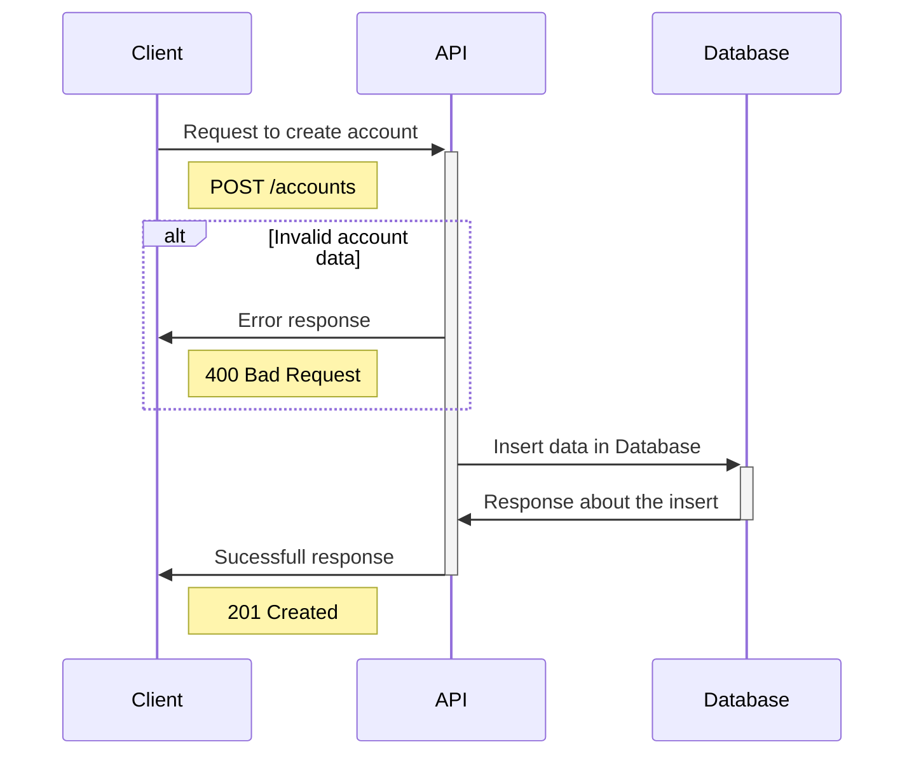
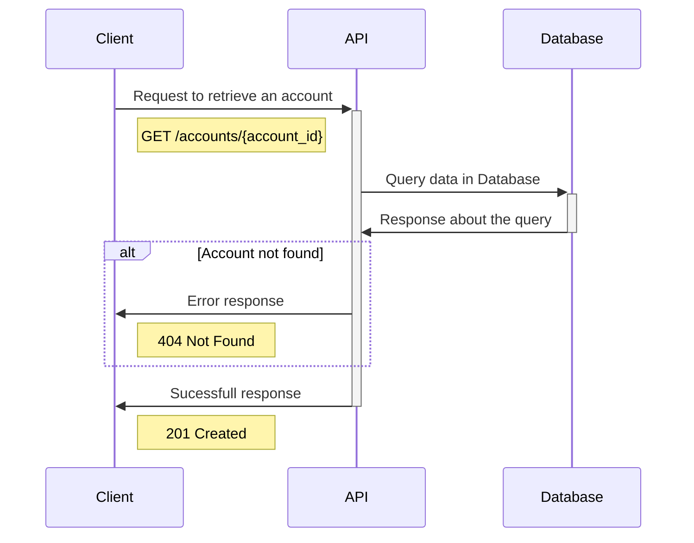
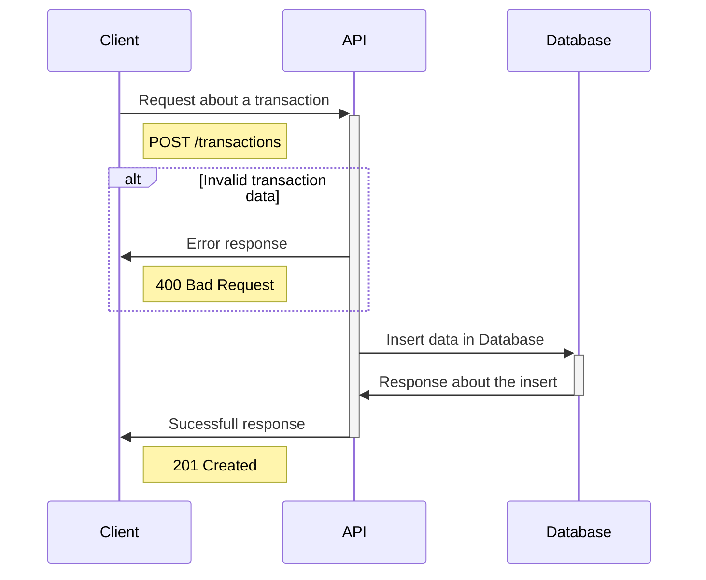

# Bank Account

- [Bank Account](#bank-account)
  - [Sumary](#sumary)
  - [Getting Started](#getting-started)
    - [Technologies](#technologies)
  - [Model](#model)
    - [Rules](#rules)
  - [Endpoints](#endpoints)
    - [POST /accounts](#post-accounts)
    - [GET /accounts/{account\_id}](#get-accountsaccount_id)
    - [POST /transactions](#post-transactions)
  - [TODOs](#todos)

## Sumary

This project was a challenge from Pismo.

## Getting Started

### Technologies

- ☕ Java 8
- 🍃 Spring Boot
- 🐋 Docker

## Model

### Rules

- When storing **documentNumber**, it's importante to save as a cryptographed field.
- We have 4 **types of operations**:
  - **COMPRA_A_VISTA**
  - **COMPRA_PARECELADA**
  - **SAQUE**
  - **PAGAMENTO**
- Besides **PAGAMENTO** that is saved as a positive numeric value, every other type in the list above need to be stored as a negative value.

## Endpoints

### POST /accounts

### GET /accounts/{account_id}

### POST /transactions

## TODOs

- [ ] Write the README
- [ ] Add Security Layer
- [ ] Create Endpoints
  - [ ] POST Account
  - [ ] GET Account by ID
  - [ ] POST Transaction
- [ ] Add Dockerfile
- [ ] Add DockerCompose
- [ ] 
